# User Manual — Boondockers' Helper

This manual explains how to read and use the dashboard and HTML reports once the tool
is installed and collecting data. For setup instructions see [README.md](../README.md).

---

## Contents

1. [Overview](#overview)
2. [The Live Dashboard](#the-live-dashboard)
3. [SOC Status Bar](#soc-status-bar)
4. [Summary Cards](#summary-cards)
5. [State of Charge Chart](#state-of-charge-chart)
6. [Daily Battery Usage Chart](#daily-battery-usage-chart)
7. [Charge Rate Chart](#charge-rate-chart)
8. [Session Tables](#session-tables)
9. [Shore Power Checkbox](#shore-power-checkbox)
10. [Classifying Charging Sessions](#classifying-charging-sessions)
11. [Adding Notes](#adding-notes)
12. [The HTML Report](#the-html-report)
13. [Typical Daily Workflow](#typical-daily-workflow)
14. [Diagnostics Panel](#diagnostics-panel)
15. [Using Your Data to Improve Your System](#using-your-data-to-improve-your-system)
16. [Troubleshooting](#troubleshooting)

---

## Overview

The tool polls your BMV-712 battery monitor every minute and stores each reading.
It then analyses that data to answer the practical questions a boondocker cares about:

- How fast am I using battery power right now, and is that typical?
- How much power do I have left, and how long will it last?
- How long do I need to run the generator today?
- Is my usage trending up or down compared to last week?

The dashboard (`./start_dashboard.sh`) shows live data updated on demand. The HTML
report (`python3 -m boondockers.report`) is a portable snapshot you can share or archive.

---

## The Live Dashboard

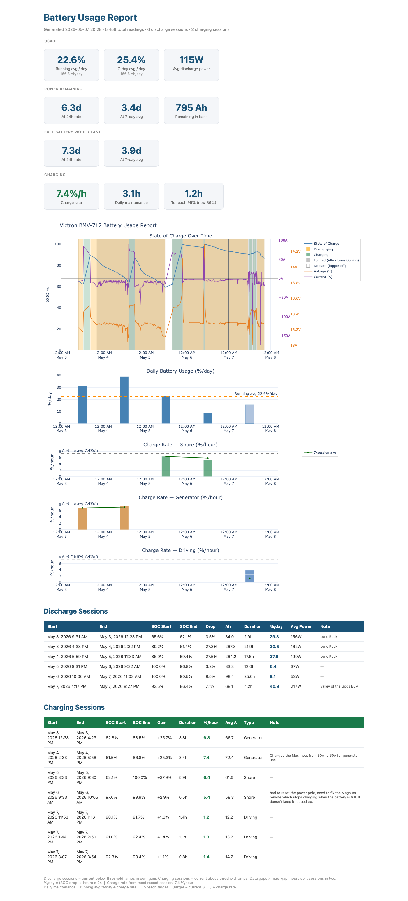

Open the dashboard:

```bash
./start_dashboard.sh
```

Two buttons appear at the top right:

- **Refresh** — reloads all data from the database and redraws everything. Use this
  after a charging session ends, or any time you want the latest numbers.
- **Download Report** — generates a standalone HTML report and opens it in your
  browser. The file is saved to the `reports/` folder with a timestamp.

The dashboard does not auto-refresh. Data is static until you hit Refresh — except
that the Shore Power checkbox and charge Type dropdown update the summary cards
immediately when changed.

Both buttons show an animated spinner while the operation is running and restore their
labels when it completes.

---

## SOC Status Bar

A full-width bar appears directly below the action buttons, before the summary cards.
It shows the current battery state at a glance:

- **Large number** — current SOC % in zone colour
- **Ah remaining** — amp-hours in the bank (shown when `battery_capacity_ah` is set in config.ini)
- **Progress track** — tri-color bar showing the full 0–100% range with zone boundaries:

| Zone | Colour | Meaning |
|------|--------|---------|
| 0–30% | Red | Low — charge soon |
| 30–60% | Amber | Getting low — plan charging |
| 60–100% | Green | Comfortable |

The solid fill extends to your current SOC. The border and the SOC number both shift
colour with the zone, so the status is readable without reading the number.

The bar updates each time you hit **Refresh**.

---

## Summary Cards

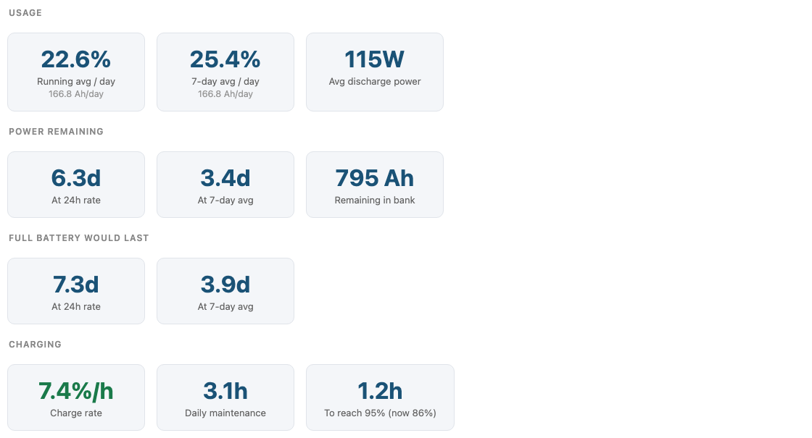

The summary cards give you a quick read on battery state. They are divided into four rows.

### Usage

| Card | What it means |
|------|--------------|
| **Running Avg** | Average % SOC consumed per day across all boondocking discharge sessions. The sublabel shows the equivalent Ah/day. This is your long-term baseline. |
| **7-Day Avg** | Same calculation but only the last 7 complete calendar days. Tracks recent trends — if this is higher than the Running Avg, consumption is increasing. |
| **Avg Power** | Implied average power draw in watts, estimated from %/day × battery capacity × nominal voltage ÷ 24. A rough cross-check against your known loads. |

> **Note:** Shore and Driving charging sessions are excluded from usage calculations,
> as are any discharge sessions you have explicitly marked Shore Power.
> See [Shore Power Checkbox](#shore-power-checkbox) and
> [Classifying Charging Sessions](#classifying-charging-sessions).

### Power Remaining

| Card | What it means |
|------|--------------|
| **At 24h rate** | Hours of power left at the current Running Avg rate, starting from the current SOC. |
| **At 7-day avg** | Same but using the 7-Day Avg rate. |

These show `—` if there is not enough discharge data yet to calculate a rate.

> **Current SOC and Ah remaining** are shown in the status bar at the top of the dashboard, above the summary cards.

### Full Battery Would Last

How long a fully charged battery (100% SOC) would last at each rate. Useful for planning
multi-day trips away from a generator or shore power.

### Charging

| Card | What it means |
|------|--------------|
| **Charge Rate** | CC phase rate from the most recent non-Shore/Driving session (%/hour). |
| **Daily Maintenance** | Hours of generator time per day needed to offset the Running Avg consumption rate. |
| **To 95% — Generator** | Hours to reach your target SOC from the current SOC, using the last **Generator** session's CC rate. This is your AGS shut-off estimate. |
| **To 100% — Shore** | Hours to reach 100% from the current SOC, using the last **Shore** session's CC rate. This is your hookup departure estimate. Shows N/A until at least one session is tagged Shore. |

The two time cards answer different questions:

- **To 95% — Generator** is for when you're boondocking and need to run the generator. You want to stop at 95% (or whatever `target_soc_pct` is set to) to avoid the slow CV tail — the last few percent of charge take as long as the first 90 combined. This card tells you how long to run the generator and when to shut it off.

- **To 100% — Shore** is for when you're on hookup and planning to leave. You don't have to ration shore power, so the question isn't when to stop — it's when you can leave with a full battery. This card counts down to 100%.

> **Target SOC is set below 100%** so the generator card tells you to stop before
> the battery is completely full. Running the generator past the point of diminishing
> returns wastes fuel. 95% is the default — adjust `target_soc_pct` in config.ini to
> whatever makes sense for your setup.

---

## State of Charge Chart

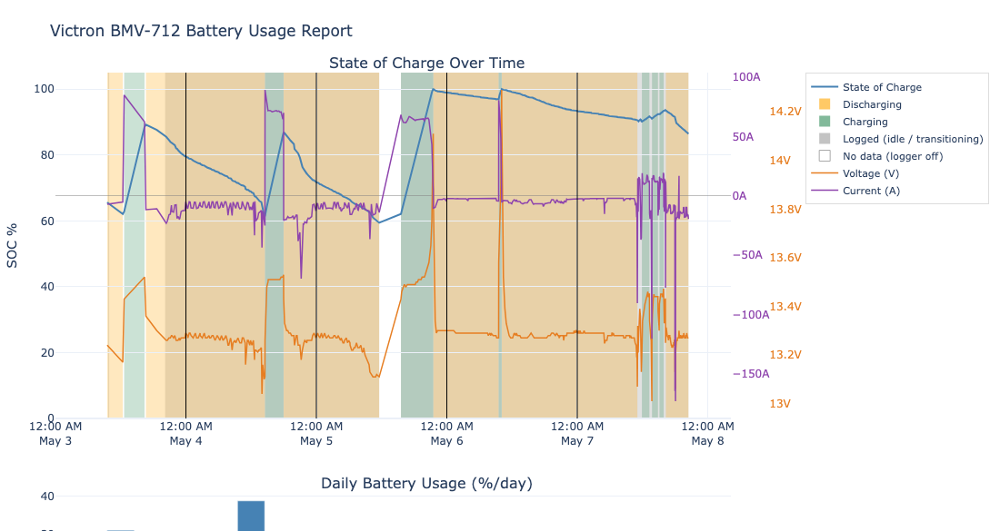

This is the main chart. It shows battery State of Charge (%) over time.

### Reading the chart

- **Blue line** — State of charge on the left y-axis. When `battery_capacity_ah` is set in config.ini the axis shows **Ah** (e.g. 0–920 Ah); hover shows both Ah and %. Without a capacity setting it shows SOC %.
- **Orange trace** — Voltage in V (right y-axis, with "V" suffix on tick labels)
- **Purple trace** — Current in A (right y-axis, with "A" suffix; negative = discharging)
- **Zero reference line** — thin grey horizontal line at 0A on the current axis
- **Shaded regions** — background colour shows what was happening during each period:

| Colour | Meaning |
|--------|---------|
| Orange | Discharge session |
| Green | Charging session |
| Light grey | Logger was running but no session recorded — brief transition, current near zero, or session too short to keep |
| White | No data — logger was off or laptop was asleep |

The distinction between light grey and white matters on busy days (e.g. driving with
frequent stops): grey means the data exists and the gap is just a classification
boundary; white means the logger genuinely wasn't running.

### Downsampling

The tool stores one reading per minute, which would produce very large files for
multi-week views. Data is automatically thinned before display:

| Data age | Resolution shown |
|----------|-----------------|
| Under 6 hours | Every reading (full 1-minute resolution) |
| 6–24 hours old | Thinned to ~1 point per 5 minutes |
| Older than 24 hours | Thinned to ~1 point per 15 minutes |

Session boundary points (the exact start and end of each session) are always kept at
full resolution regardless of age, so session edges are always sharp.

The thinning uses the LTTB algorithm (Largest Triangle Three Buckets), which
preferentially keeps visually significant points — peaks, troughs, and inflections —
rather than throwing away data uniformly.

### Time range

Quick-navigation buttons above the SOC chart let you snap to a preset window:
**3d · 7d · 14d · 30d · All**. The default view on load is the last 3 days.
All subplots scroll together on the same shared x-axis.

### Hovering

- Hover over the **SOC line** to see the exact SOC %, Ah remaining (when capacity is
  configured), timestamp, and voltage/current at that moment.
- Hover over a **shaded session region** (away from the line) to see any note you have
  added for that session.

---

## Daily Battery Usage Chart

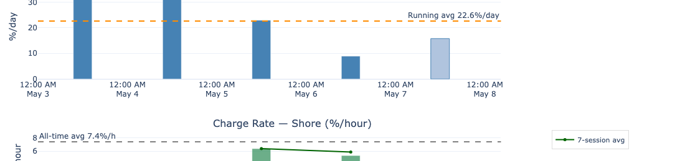

Each bar represents one calendar day. The height is **% SOC consumed that day**,
expressed as an annualised %/day rate (so a partial day is projected to a full-day rate).

### What the bars mean

- **Dark blue bars** — complete calendar days
- **Light blue bar** — today (partial day; the rate will change as the day progresses)
- **Dashed orange line** — running average %/day across all complete days
- **Hover tooltip** — shows the %/day rate and the actual Ah consumed that day

### Midnight splits

A discharge session that spans midnight is split: the portion before midnight counts
toward the previous day, the portion after counts toward the current day. This keeps
the bars aligned to calendar days even for overnight discharges.

### Averages

- **Today's bar** is excluded from the 7-day average and the running average — a partial
  day would artificially lower the average.
- Only complete calendar days with at least some discharge data contribute to averages.
- Shore Power discharge sessions are excluded — their days will have no bar or a smaller
  bar if only part of the day was on shore power.

---

## Charge Rate Chart


This chart shows the charging speed (% SOC gained per hour) for each charging session,
grouped by session type.

### Subplots

One subplot is shown per charging type that has data:

| Type | Colour | Meaning |
|------|--------|---------|
| Shore | Green | Plugged into shore power (campground, marina, house) |
| Generator | Orange | Generator charging |
| Driving | Blue | Alternator charging while driving |
| Unclassified | Grey | Sessions not yet labelled |

If no sessions have been classified yet, a single "All Sessions" subplot is shown instead.

### Lines

- **Rolling 7-session average** — solid line tracking recent charge rate trend
- **All-time average** — dashed horizontal line (not shown for Unclassified)

### CC phase rate vs full-session rate

Lithium charging happens in two phases:

- **CC (Constant Current)** — the charger pushes maximum current; SOC rises quickly
- **CV (Constant Voltage)** — once the battery approaches full, the charger holds
  voltage constant and current tapers from full amps down to near zero; SOC rises
  slowly

The chart bars and the **Charge Rate** summary card show the **CC phase rate only**:
the speed from session start to the CC→CV transition (the "knee"). This is a more
meaningful number than the full-session rate, because it captures how fast your
charger actually charges — not how long the tail took.

**Why this matters:**

- A Shore session that runs all the way to 100% has a long CV tail. A full-session
  average rate would be dragged down significantly by that tail. The CC rate shows
  the true charger speed.
- Generator sessions usually end before the CV phase (you stop the generator when
  SOC is high enough). Their CC rate equals the full-session rate — no correction
  needed.
- If two sources seem to show different rates, check whether one runs through to CV
  and the other doesn't. Once both show CC rates, the comparison is apples-to-apples.

**Knee SOC:**

The **Knee SOC** column in the Charging Sessions table shows the battery % at which
the CC→CV transition was detected. For a healthy lithium bank it should be
consistently high — typically 95–99%. If you see the knee appearing at 80–85%
instead, that is not normal battery behaviour. See
[Patterns to Watch](#patterns-to-watch-over-time) for what that may indicate.

> **Note on detection accuracy:** The CC→CV transition on the Magnum is gradual
> rather than a sharp step, so the detected knee may appear a few percent higher
> than the true physical transition. This is a conservative bias — the reported CC
> rate will be slightly lower than the true value. Detection improves as more shore
> sessions accumulate.

### Interpreting the chart

A declining charge rate over time can indicate:
- Battery degradation
- Connections loosening
- Charger settings drifting

A consistently lower rate for Generator vs Shore is normal — shore power chargers
often run at higher current than generator-fed chargers.

---

## Session Tables

Two tables appear below the charts. Both are dashboard-only — the HTML report shows
read-only versions without interactive controls.

### Discharge Sessions

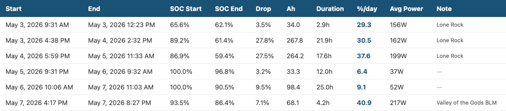

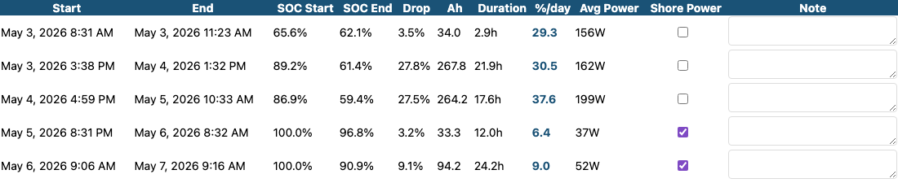

| Column | Meaning |
|--------|---------|
| ⚠ | Diagnostic warning — hover for details. Appears when a parasitic drain was detected immediately before this session. See [Diagnostics Panel](#diagnostics-panel). |
| Start / End | Session start and end time |
| SOC Start / End | Battery % at start and end |
| Drop | SOC points lost (start − end) |
| Ah | Amp-hours consumed, from the BMV's Coulomb counter |
| Duration | Elapsed time |
| %/day | Annualised consumption rate for this session |
| Avg Power | Average watts drawn: Ah ÷ hours × average voltage |
| Shore Power | Checkbox — see [Shore Power Checkbox](#shore-power-checkbox) |
| Note | Free-text field — see [Adding Notes](#adding-notes) |

### Charging Sessions

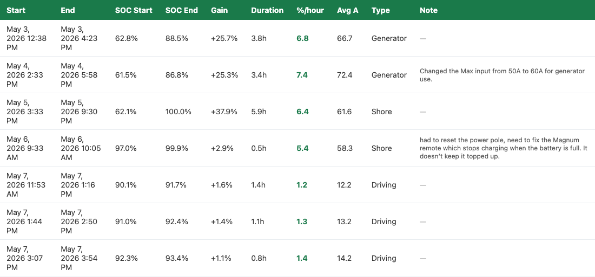

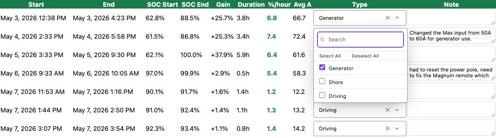

| Column | Meaning |
|--------|---------|
| ⚠ | Diagnostic warning — hover for details. Appears when one or more anomalies are detected for this session. See [Diagnostics Panel](#diagnostics-panel). |
| Start / End | Session start and end time |
| SOC Start / End | Battery % at start and end |
| Gain | SOC points gained |
| Duration | Elapsed time |
| %/hour | Full-session charging rate (SOC gain ÷ total hours) |
| CC %/hr | CC phase rate — speed during the constant-current phase only; equals %/hour when no CV phase was detected (see [Charge Rate Chart](#charge-rate-chart)) |
| Knee SOC | Battery % at the CC→CV transition; blank if no CV phase detected |
| Avg A | Average charge current |
| Type | Multi-select dropdown — see [Classifying Charging Sessions](#classifying-charging-sessions) |
| Note | Free-text field — see [Adding Notes](#adding-notes) |

---

## Shore Power Checkbox

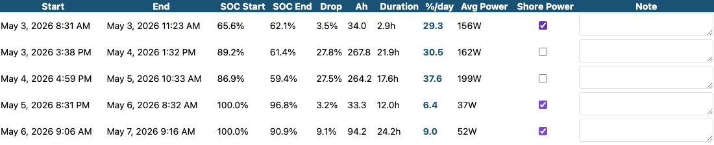

The **Shore Power** checkbox in the Discharge Sessions table marks a discharge session
as occurring while connected to shore power. Checked sessions are excluded from:

- The daily usage bars
- Running Avg and 7-Day Avg summary cards
- Power Remaining calculations
- All Avg Power figures

### When to check it

Check Shore Power when the battery discharged while you were plugged into a campground,
marina, or house — and you don't want that to skew your boondocking averages. Common
situations:

- Connected to shore but the charger failed or wasn't turned on (battery slowly drained
  from DC loads while AC loads ran off the inverter/charger passthrough)
- Parked at home between trips
- Campground hookup where you chose not to charge

### When NOT to check it

If you disconnect from shore and drive or boondock, the subsequent discharge session
is a real boondocking session — leave the checkbox unchecked even if the previous
charge was from shore power.

### How it works

Checking the box saves immediately to the database and updates the summary cards and
chart on the spot — no Refresh needed. Unchecking restores the session to the averages
immediately.

> **Note:** Shore Power discharge sessions still appear as orange shaded regions in the
> SOC chart. They are only excluded from the calculations, not hidden from the chart.

---

## Classifying Charging Sessions


The **Type** dropdown in the Charging Sessions table labels each charging session by
source. This is the single most important thing you can do to make the summary cards
accurate.

### Why it matters

Labelling sessions correctly is what makes the two time cards meaningful:

- The **To 95% — Generator** card uses only Generator-tagged sessions for its rate.
  Shore and Driving sessions are excluded because shore power often charges faster and
  would make the generator estimate optimistic.
- The **To 100% — Shore** card uses only Shore-tagged sessions. It shows N/A until
  you tag at least one Shore session. Once you do, it tracks the actual shore charge
  rate and gives you a reliable departure estimate.

Shore and Driving sessions are also excluded from the charge rate history subplots
(they appear in their own subplot rows instead).

### How to label

1. Find the session in the **Charging Sessions** table
2. Click the **Type** cell
3. Select one or more types:
   - **Shore** — plugged into external AC power (campground, marina, house)
   - **Generator** — generator charging
   - **Driving** — alternator/DC-DC charging while driving
4. The label saves automatically and the Charge Rate chart updates immediately

### Combinations

- **Generator + Driving** is valid — e.g., generator ran while also driving
- **Shore + Driving** is not allowed — Shore is automatically removed if Driving is
  selected (you can't be plugged into shore while moving)
- **Shore + Generator** is valid — unusual but possible

---

## Adding Notes

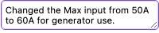

The **Note** field in both session tables is a free-text comment field. Click any Note
cell to start typing. Notes save automatically when you click away.

### What notes are for

Notes let you annotate unusual sessions so you can understand them later:

- "Ran A/C all afternoon — unusually high draw"
- "Generator only ran 2h — stopped early due to noise complaint"
- "Drove 6h to new site"
- "Left inverter on overnight by mistake"

### Notes on the SOC chart

Sessions with notes show a hover tooltip on the SOC chart. After adding a note, click
**Refresh** to rebuild the chart with the new tooltip. Then hover inside the shaded
session region, away from the SOC line — the lower portion of the chart works best
(the SOC line wins hover when you are close to it).

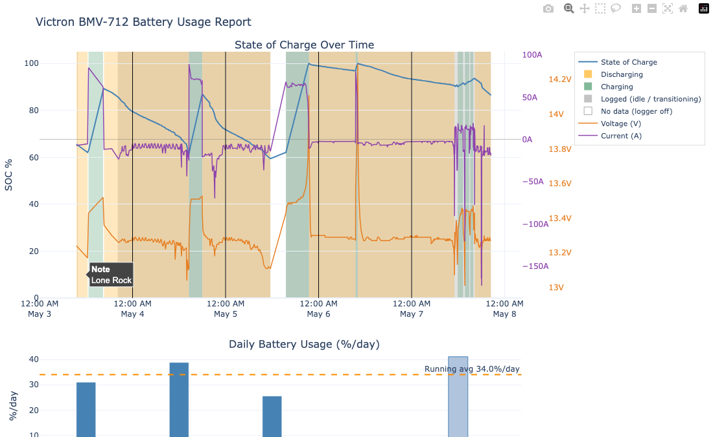

### Notes in the HTML report

Notes appear as a **Note** column in the discharge and charging session tables of the
HTML report (see [Session Tables](#session-tables)). Sessions without a note show a dash.

---

## The HTML Report

The HTML report contains all the same charts and tables as the dashboard, rendered as
a single portable file. It does not require the dashboard server to be running.

Notes, charge types, and Shore Power flags are embedded at the time the report is
generated — they do not update live. Sessions marked Shore Power are excluded from
bars and cards in the report just as in the dashboard. Notes appear as a **Note**
column in both session tables.

Generate one:

```bash
python3 -m boondockers.report               # last 30 days
python3 -m boondockers.report --days 14     # last 14 days
python3 -m boondockers.report --no-open     # generate without opening browser
```

Reports are saved to `reports/report_YYYYMMDD_HHMMSS.html`. They can be shared,
emailed, or archived. All interactivity (hover, zoom, pan) works offline.

---

## Diagnostics Panel

The diagnostics panel appears between the main chart and the session tables. It
automatically detects anomalous patterns in your data and shows an alert card for
each one found. No anomalies = no panel.

Inline **⚠** icons in the session table rows point to the specific session(s) that
triggered each alert. Hover over the icon for a brief description.

Diagnostic flags are saved to the database on each Refresh, so the panel is visible
immediately when you reopen the dashboard — even before clicking Refresh.

---

### Thermal Derating

**What it means:**
The charger started at high current, then stepped down significantly within the first
30 minutes and stabilised at a lower plateau. This is a thermal throttle — the charger's
internal protection reduced output because it was overheating.

**What triggers it:**
Current drops more than 15% from the session peak within the first 30 minutes, and
the peak current exceeds 30 A (rules out low-current trickle sessions).

**Example alert:**
> *Thermal Derating — 2 sessions*
> Charger output dropped significantly within the first 30 minutes.
> Check charger bay ventilation and airflow path.
> May 3: 85A peak → 63A plateau
> May 8: 89A peak → 71A plateau

**What to do:**
- Verify the charger bay has both an intake path and an exhaust path. The fan pulls air
  *through* the unit — without an intake it recirculates hot air.
- Check the charger's Max Charge Amps setting on the remote display.
- Monitor the charger temperature in real time on the Magnum remote during a generator
  session. If amps step down as temperature climbs, derating is confirmed.
- Compare plateau amps before and after any airflow improvements to verify the fix.

**Config threshold:**
```
thermal_derating_drop_pct = 15       ; % drop from peak to trigger the flag
thermal_derating_window_minutes = 30  ; detection window for the initial peak
```

**What the detector does and does not flag:**
The detector requires both a >15% current drop from the early-window peak *and* that
the drop is still descending after the 30-minute window. A one-time step down that
happens right at the window boundary — with the session completing normally — is not
flagged even if the plateau is 20% below the peak. This covers the common pattern of
a charger settling from an initial boost to its rated output. A *continuous gradual
decline* that crosses the threshold well into the session — the signature of a charger
heating up over time — is always flagged.

**How to confirm or rule out derating:**
The definitive test is an *open-bay baseline*: open all charger bay doors (or access
panels), run a full charging session on a cool morning (under 70°F / 21°C) using shore
power or the generator — either source works. On a healthy system with good airflow,
current should hold near its initial level for the entire CC phase and only taper
naturally when the battery approaches the absorption setpoint. If derating flags
disappear under these conditions but return when the bay is closed, restricted airflow
is confirmed.

**Case study — May 2026, Magnum MS-PAE:**
Open-bay shore-power session on a 60°F morning: started at 92 A, dropped to 73 A at
the 30-minute mark, completed normally — not flagged (drop at window boundary with
normal CC→CV completion). Same week, closed-bay generator session in the evening:
started at 71 A and declined continuously to 54 A over 90 minutes — flagged (sustained
gradual decline well past the window). The open-bay test isolated the variable (bay
temperature) and confirmed the detection is working correctly.

---

### Knee SOC Drift

**What it means:**
The CC→CV transition (the "knee") is appearing at a lower SOC than your historical
baseline. A healthy lithium bank typically transitions at 95–99% SOC. A lower knee
means the charger or BMS is entering CV mode prematurely.

**What triggers it:**
The latest session's Knee SOC is more than 10% points below the rolling median of the
previous 5 sessions (minimum 5 sessions with CV detected needed to establish a baseline).

**Example alert:**
> *CC→CV Knee SOC Drift*
> Latest session: knee at 83.0% vs baseline median 97.0% (Δ 14.0 pts).
> Possible BMS protection or thermal limiting at lower SOC than normal.

**What to do:**
- **Thermal cause**: If thermal derating is also showing at the same time, the charger may
  be hitting its thermal limit before the battery is ready to taper. Improving airflow
  (see Thermal Derating above) may push the knee back up.
- **BMS cause**: A weak or imbalanced cell can trigger the BMS to cut charge current early
  to protect that cell. This is a more serious finding — consider a cell-level voltage
  check with a BMS display or battery manufacturer diagnostic tool.
- **One-off vs trend**: A single anomalous session can reflect unusual conditions (very hot
  day, abnormally long session). The alert is more meaningful if the knee SOC stays low
  over several consecutive sessions.

**Config threshold:**
```
knee_soc_baseline_sessions = 5       ; minimum sessions before baseline is valid
knee_soc_drop_threshold_pct = 10     ; pts below median to trigger the flag
```

---

### Charge Rate Declining

**What it means:**
Your recent Generator (or Shore, or Driving) sessions are charging significantly slower
than your historical average for that source. This is a trend alert, not a per-session
flag — it fires when the last 3 sessions together average well below the all-time average.

**What triggers it:**
The last-3-session CC rate average is more than 20% below the all-time CC rate average
for that charging type, with at least 4 sessions of that type on record.

**Example alert:**
> *Charge Rate Declining — Generator*
> Recent 3-session CC avg: 4.20%/hr vs all-time avg: 6.80%/hr (38% decline).
> Check battery connections, charger output, and source health.

**What to do:**
- **Connections**: Rising resistance from oxidised terminals, loose lugs, or a degraded
  shunt connection is the most common cause. Check and re-torque all battery-side
  connections.
- **Generator health**: A generator that's running but not putting out full AC voltage
  (governor, carburetor, or load regulation issue) will limit charger output. Check AC
  voltage at the charger input.
- **Charger settings**: Verify Max Charge Amps has not been changed. Some Magnum remotes
  can accidentally change this during menu navigation.
- **Shore vs Generator divergence**: If Shore rate is holding but Generator is declining,
  the generator is more likely the culprit than the charger or battery.

**Config threshold:**
```
charge_rate_decline_threshold_pct = 20  ; % below all-time avg to trigger the flag
```

---

### Parasitic Drain

**What it means:**
The battery lost SOC during a period when no charging or discharging session was
recorded — the logger was running, current was near zero, but SOC was still declining.
This suggests a load that is not large enough to trigger a session (below
`threshold_amps`) but is continuously drawing power.

**What triggers it:**
SOC drops more than 2% over a gap of at least 4 hours with no session active. The
⚠ icon appears in the discharge session table on the session that immediately follows
the drain period.

**Example alert:**
> *Possible Parasitic Drain*
> 2026-05-07 23:00 – 2026-05-08 05:20: 4.2% SOC lost over 6.3h with no active session.
> Check for loads running while the battery was otherwise idle.

**Typical culprits:**
| Load | Typical draw | Notes |
|------|-------------|-------|
| Inverter on standby | 1–5 A | Most common; turn off when not needed |
| Magnum ME-ARC remote display | ~0.5 A | Always on when connected |
| DC refrigerator | 2–5 A cycling | Would normally appear as a session; check threshold_amps |
| Lighting left on | 0.5–3 A | Easy to miss in storage |
| Battery monitoring systems | 0.1–0.3 A | Background draw, expected |

**What to do:**
- Note the start time of the drain period from the alert card.
- Check the current trace in the SOC chart at that time — even a steady 1–2 A draw
  will be visible as a slight negative current.
- Systematically turn off DC breakers one at a time while watching the current reading
  on the BMV display. When the draw disappears, you've found the source.

**Config threshold:**
```
parasitic_drain_threshold_pct = 2   ; % SOC drop to trigger the flag
parasitic_drain_min_hours = 4       ; idle period must be at least this long
```

---

### Adjusting Thresholds

All diagnostic thresholds are set in the `[diagnostics]` section of `config.ini`.
Default values are conservative — they aim to avoid false positives at the cost of
possibly missing marginal anomalies. If your system regularly triggers a diagnostic
that you've investigated and confirmed as normal behaviour, raise the relevant
threshold to match your system's baseline.

After changing `config.ini`, click **Refresh** to recompute diagnostics with the new
thresholds.

---

## Typical Daily Workflow

**Morning:**

1. Open the dashboard (`./start_dashboard.sh`) and hit **Refresh**
2. Glance at **Power Remaining at 7-day avg** — do you need to run the generator today?
3. Check **To Target SOC** — how long would the generator need to run?

**After a charging session:**

1. Hit **Refresh**
2. Find the new session in the **Charging Sessions** table
3. Set its **Type** (Shore / Generator / Driving) — cards update immediately
4. Optionally add a **Note** if anything was unusual

**After connecting to shore power (without charging):**

1. Hit **Refresh** when you notice the discharge
2. Check **Shore Power** on the discharge session — cards update immediately

**Weekly:**

1. Compare **7-Day Avg** to **Running Avg** — is consumption trending up?
2. Review the **Charge Rate** chart — is the generator charging as fast as usual?
3. Generate an HTML report as an archive: `python3 -m victron.report`

---

## Using Your Data to Improve Your System

The charts and session data are diagnostic instruments, not just records. Patterns that
emerge over time can reveal real problems and opportunities in your electrical system.
This section documents observations drawn from actual session data and what they mean.

---

### Case Study 1: Charger Thermal Derating

**What the data showed:**

Two Generator-only charging sessions (May 3–4, 2026) both showed the same shape: a
peak in the first reading, a fast drop over 15–30 minutes, then a stable plateau for
hours. SOC was in the low 60s at the start of both sessions — well below the point
where a lithium battery starts to limit acceptance.

| Time into session | May 3 | May 4 |
|-------------------|-------|-------|
| Start | 84.9 A | 89.2 A |
| 15 min | 73.5 A | 79.9 A |
| 30 min | 72.8 A | 72.2 A |
| Plateau (60 min+) | ~64 A | ~71 A |

Rated charger capacity: 100 A. Configured at 100%. Battery ready to absorb full current.

**Interpretation:**

This is the textbook thermal derating signature. The charger drives near capacity,
heats up, and its internal protection steps the output down to a level it can sustain
thermally. The stable plateau is thermal equilibrium — heat generated equals heat
dissipated. The two sessions settle at different plateaus (64 A vs 71 A), reflecting
slightly different ambient or bay conditions on those days.

Note that neither session starts anywhere near 100 A. That means the charger bay was
already warm before the generator fired up, or there is a persistent AC-side limit
(wiring, breaker, or transfer switch) that prevents the charger from ever reaching
rated input power. Both possibilities are worth investigating.

**What to check:**

- On the Magnum remote display (ME-RC or ME-ARC), watch the charger temperature in
  real time during a stationary generator session. If you see amps step down while
  temperature climbs, thermal derating is confirmed.
- Verify the charger bay has a clear cool-air intake path, not just an exhaust path
  to outside. The fan pulls air *through* the unit — without an intake vent, it
  recirculates hot air from within the bay.
- Check the Magnum `Charger Setup → Max Charge Amps` setting. Confirm it is at the
  rated value and was not set conservatively during installation.
- Verify the AC breaker feeding the Magnum is sized for the charger's full rated
  draw (~1,800 W at 100 A output, assuming 85% efficiency).

**How to track improvement:**

After any airflow or wiring changes, compare future Generator sessions to the May
baseline. A successful fix should push the steady-state plateau from ~64–71 A toward
80–90+ A. The Charge Rate chart's 7-session rolling average line will show the trend
clearly over successive sessions.

---

### Case Study 2: Shore Charging Shows the Same Limit

**What the data showed:**

A Shore session on May 5 (62% → 100% SOC, ~5.8 hours) averaged 61.6 A. A second
Shore top-off on May 6 (97% → 100%) averaged 58.3 A.

**Interpretation:**

The Magnum inverter/charger is the same unit whether it is fed by the generator or
shore power. The charger bay is the same. So the same thermal limit applies. Shore
sessions are not exempt.

The May 6 average is lower because most of that session was CV-phase taper (the
battery was nearly full and naturally limiting acceptance). The May 5 session ran
the full CC phase and still averaged only 61.6 A — consistent with the thermal
plateau seen in the Generator sessions.

**What this means for planning:**

Shore charging times should be estimated using your *observed* plateau rate, not
the rated 100 A. At ~65 A effective, a full charge from 60% on a 920 Ah bank takes
roughly 5–6 hours, not the ~3.5 hours you would calculate from rated capacity. If
you are on a metered hookup or have a limited window at shore power, this matters.

---

### Case Study 3: Decomposing Combined Charging Sessions

**What the data showed:**

A Generator + Driving session on May 8 showed 63.9 A average. Taken alone that
figure is hard to interpret — is the generator underperforming, or the DC-DC, or both?

The Magnum's thermal plateau from standalone Generator sessions (Case Study 1) was
~64–71 A. The DC-DC (Driving) contribution in that session was estimated at ~16 A,
leaving roughly **48 A from the Magnum** — below its thermal plateau, which itself
is already below rated capacity.

**What to do:**

When you drive with the generator running, always label the session with *both*
Generator and Driving selected. It will appear in its own combined subplot rather
than being split and double-counted across two separate subplots. As more Driving
data accumulates, you will be able to cross-reference a reliable DC-DC baseline and
back out the pure Magnum contribution from any combined session.

---

### Patterns to Watch Over Time

Beyond specific case studies, these are the patterns most worth monitoring as your
data accumulates:

**Declining charge rate trend (Charge Rate chart)**

If the 7-session rolling average in the Generator subplot trends downward over
weeks or months — at similar starting SOC — without a clear cause:
- Check battery terminal connections. Resistance rises as connections oxidise.
- Check the inverter/charger connections at the battery and shunt.
- A sustained drop in shore sessions too (same charger, same connections) points
  to the charger or wiring rather than the generator.
- A drop only in Generator sessions could indicate the generator itself is not
  reaching full output voltage.

**Unexplained overnight SOC drop (SOC chart)**

If the battery loses SOC overnight with no intentional loads:
- A parasitic draw is running — inverter on standby, a DC device not switched off,
  a relay holding open.
- Read the current trace in the SOC chart during that overnight window. Even a
  steady 2–3 A overnight consumes 24–36 Ah — roughly 3–4% of a 920 Ah bank.
- Use the Note field to annotate the session with what you later identified as
  the cause. Over time this builds a catalogue of your system's known drains.

**High variance in daily usage bars**

Large swings from day to day usually correspond to specific loads. Annotate
high-draw days in the Note field (ran A/C, heated blanket, guests, work
calls all day, etc.). After a few months you can read the bars like a log
and quickly correlate spikes to activities — which tells you exactly where
to cut if you ever need to extend your boondocking window.

**Premature CV taper during charging (Knee SOC column, SOC chart)**

A healthy lithium charge holds near-constant current until roughly 95–99% SOC,
then tapers quickly. The **Knee SOC** column in the Charging Sessions table records
this transition automatically for each session. If the knee is consistently appearing
at 95%+ you are in normal territory. If it starts appearing at 80–85%, that is a
warning sign.

A low knee SOC can mean:
- A weak or imbalanced cell triggering BMS protection early
- The charger hitting its thermal limit (see Case Study 1) before the battery is
  ready to taper naturally

The advantage of tracking Knee SOC over time is that a single anomalous session is
easy to dismiss; a trend of declining knee SOC over successive sessions is harder to
ignore. You can also cross-check visually: the current trace in the SOC chart will
show the taper beginning at a lower-than-normal SOC.

**Battery drifts down from 100% on shore — Magnum ME-ARC50-L / no-BMK limitation**

The Magnum uses CC/CV charging, which is correct for lithium: constant current to
absorption voltage, then constant voltage until current tapers, then the cycle
terminates. There is no float phase — terminating at 100% and stopping is the
right behaviour for lithium chemistry.

The problem is what happens next. Once the charger terminates, parasitic DC loads
(inverter standby, monitors, fans, etc.) slowly draw the battery down from 100%.
For the Magnum to know when to re-engage, it needs SOC feedback. That feedback
comes from the Magnum BMK (Battery Monitor Kit). Without a BMK installed, the
ME-ARC50-L has no SOC data and no way to detect that the battery has drifted. The
charger stays off indefinitely while the battery continues to drain.

The practical consequence on a long shore stay: the battery arrives at 100%, the
Magnum shuts off, and by morning the battery may be at 90% or lower with the
charger still idle.

**Workaround:** Turn shore power off, then back on. This restarts the Magnum's
charge cycle from scratch and it will top the battery back to 100%.

**Long-term fix:** Install a Magnum BMK. With SOC feedback, the ME-ARC50-L can
detect the drift and automatically re-initiate the charge cycle to maintain the
battery near 100% during extended shore stays.

---

## Troubleshooting

### "No data" or chart is empty

- Check the logger is running: `launchctl list | grep victron`
- Verify the database has data: `sqlite3 victron_data.db "SELECT count(*) FROM readings;"`
- If count is 0, run `python3 boondockers/providers/victron_ble.py --once` to test the BLE connection

### Gap in the SOC chart

- The laptop was asleep, away from the monitor, or the logger was stopped
- Gaps larger than `max_gap_hours` split the data into separate sessions — this is expected
- No data is lost; the gap just means that period wasn't recorded

### Summary cards show `—`

- Not enough data yet. Running Avg requires at least one complete discharge session.
  7-Day Avg requires complete calendar days with discharge data.
- Check whether too many sessions are marked Shore Power — if all discharge sessions
  are excluded, the cards will show `—`.

### No daily bar for a day I was boondocking

- Check whether the discharge session for that day has Shore Power checked — uncheck
  it to restore the bar
- If the SOC barely moved that day (flat battery), there may genuinely be no bar

### SOC jumped unexpectedly

- A charging session may have been misclassified or missed entirely
- Check the **Charging Sessions** table for unlabelled sessions around that time
- The BMV resets its Coulomb counter when it detects a full charge (100% SOC) — this
  is normal and appears as an SOC reset in the chart

### Charge rate or time cards seem wrong

- Make sure Shore and Driving sessions are labelled — they pollute the Generator rate
  if left as Unclassified
- The **To 95% — Generator** card uses only Generator-tagged sessions once any session
  is labelled; before that it falls back to the most recent unclassified session
- The **To 100% — Shore** card shows N/A until at least one session is tagged Shore

### Dashboard won't open

```bash
./start_dashboard.sh
```

If port 8050 is already in use:

```bash
lsof -i :8050          # find what is using the port
kill <PID>             # stop it, then retry
```
