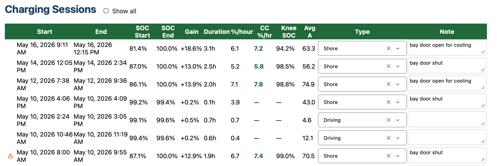
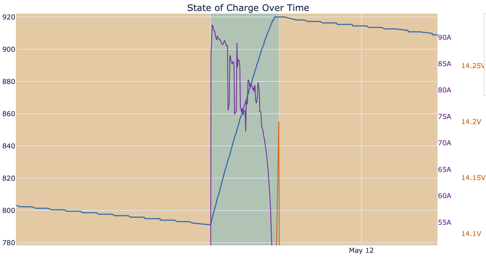
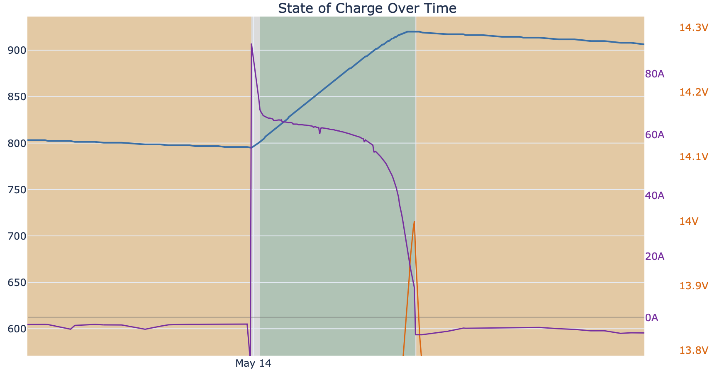
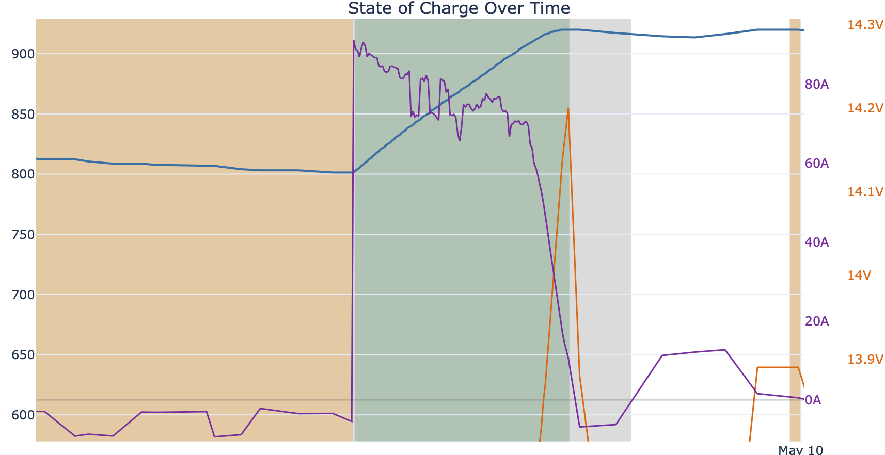
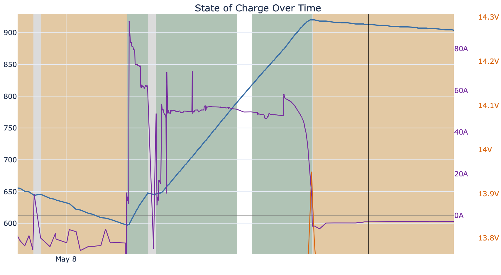

# Shore Charging: Bay Door Open vs. Closed
### A Case Study in Charger Thermal Management
*Data collected May 8–16, 2026 · Magnum 2000 · Victron BMV-712 · Boondockers' Helper*

---

## Background

The Magnum 2000 inverter/charger lives in a sealed bay. A simple question: does opening the bay door for airflow during shore charging make the charger run faster?

## Summary

Yes — meaningfully so. Across six shore charging sessions in May 2026, door-open sessions charged **36% faster** (68.9 vs 50.7 Ah/hr), restoring about 7½% SOC per hour instead of 5½% — meaning a battery starting at 50% reaches 95% in roughly 6 hours with the door open versus 8 hours with it shut. Door-open sessions also delivered **27% more current** (69.1 vs 54.4A average). Both groups started at nearly the same battery level, so the difference in charge speed reflects the door, not the starting point. Thermal derating — the charger cutting output to protect itself from heat — was detected only in door-shut sessions. The May 8 long session (6 hours, door shut) shows a subtler version of the same problem: the charger started with the most headroom of any session and posted the lowest rate, consistent with slow heat buildup over hours that the automated detector doesn't catch.

Consider opening the bay door during shore power charging until a proper ventilation system can be installed. Avoid leaving it open unattended if children or animals are nearby, or if it would be inappropriate in your campground.

## Methodology

Six sessions were tagged in the dashboard Notes column as either **"bay door open for cooling"** or **"bay door shut"** to capture this. Session statistics are computed and grouped by the `analyze_door_effect.py` script included in this repo.


*The dashboard Notes column is how door state was recorded — no extra tooling needed.*

---

## Raw Session Data

| Date | Start → End SOC | Hours | CC Ah/hr | Avg A | Knee SOC | Thermal Derate | Door |
|------|-----------------|-------|----------|-------|----------|----------------|------|
| May 8  | 70 → 100% | 6.21 | 45.3 | 47.8 | 99.4% | no  | **SHUT** |
| May 10 | 87 → 100% | 1.92 | 67.9 | 70.5 | 99.0% | **YES** | **SHUT** |
| May 10 | 99 → 99%  | 0.05 | 36.4 | 43.0 | —     | no  | SHUT *(micro top-off, exclude)* |
| May 12 | 86 → 100% | 1.97 | **71.9** | **74.9** | 98.8% | no  | **OPEN** |
| May 14 | 87 → 100% | 2.48 | 53.2 | 56.2 | 98.5% | no  | **SHUT** |
| May 16 | 81 → 100% | 3.07 | **65.9** | **63.3** | 94.2% | no  | **OPEN** |

**CC Ah/hr** = constant-current phase charge rate only (excludes the CV taper where current naturally falls).  
**Knee SOC** = state of charge where the charger transitioned from CC to CV.

---

## Summary Comparison

|                          | Door OPEN (n=2) | Door SHUT (n=4\*) | Delta |
|--------------------------|-----------------|-------------------|-------|
| CC charge rate           | **68.9 Ah/hr**  | 50.7 Ah/hr        | **+36%** |
| ± std dev                | 4.3 Ah/hr       | 13.3 Ah/hr        | — |
| Avg charge current       | **69.1 A**      | 54.4 A            | **+27%** |
| Avg SOC at session start | 83.8%           | 85.8%             | *(comparable)* |
| Knee SOC (CC→CV)         | 96.5%           | 99.0%             | −2.5 pp |
| Thermal derating         | **0 / 2 (0%)**  | 1 / 4 (25%)       | — |

\* *The 3-minute micro top-off on May 10 is included in the raw average but is not meaningful. Excluding it: door-shut CC rate = 55.5 Ah/hr, delta +24%.*

The average starting SOC is nearly identical between groups (83.8% vs 85.8%), so the 36% difference isn't a quirk of one group starting with a more depleted battery — it reflects the door.

---

## The Strongest Comparison: May 12 vs May 14

The two most directly comparable sessions — nearly identical starting SOC, consecutive days, same target of 100%:

| | May 12 (door OPEN) | May 14 (door SHUT) |
|---|---|---|
| SOC at start | 86% | 87% |
| CC charge rate | **71.9 Ah/hr** | 53.2 Ah/hr |
| Avg current | **74.9 A** | 56.2 A |
| Duration | 1.97 h | 2.48 h |
| Thermal derating | no | no |

**+35% faster CC rate and +33% more amps with the door open**, at essentially the same starting SOC. This is the cleanest single data point in the set.

The current (A) traces tell the story visually — a higher, flatter plateau with the door open versus a lower plateau with the door shut:


*May 12 · Door open · 74.9A average · 71.9 Ah/hr CC rate · no thermal derating*


*May 14 · Door shut · 56.2A average · 53.2 Ah/hr CC rate · no thermal derating*

---

## Thermal Derating: May 10 (Door Shut)

The May 10 door-shut session caught the charger thermally derating — cutting its output current to protect itself from heat. The current trace shows the characteristic drop from peak:


*May 10 · Door shut · Thermal derating detected · Current dropped from ~70A peak*

This is the failure mode that ventilation prevents. None of the door-open sessions showed it.

---

## The Long Session: May 8 (Door Shut, 6 Hours)

The May 8 session is the most telling data point in the set. It started at 70% SOC — the lowest of any session, meaning the charger had the *most* room to run hard in CC phase before voltage rose to the CV setpoint. By that logic it should have been the fastest session. It was the slowest: 45.3 Ah/hr, 47.8A average.

The automated derating detector (which looks for a sharp current drop within a 30-minute window) didn't flag it. But 6 hours in a sealed bay in May is a different kind of problem: slow, cumulative heat buildup that gradually damps output without a single identifiable inflection point. The result — a charger that started with every advantage and underperformed for 6 hours — is consistent with sustained thermal throttling.


*May 8 · Door shut · 6.21 hours · 47.8A average · 45.3 Ah/hr despite starting at 70% SOC*

---

## Interpretation

### What the numbers support

**The door makes a real difference — 36% faster CC rate, 27% more current.** The starting SOC is matched between groups (83.8% vs 85.8%), so this isn't a sampling artifact. Two of the most directly comparable sessions (May 12 open vs May 14 shut) show a 35% difference at identical starting conditions.

**The variance tells the story too.** Door-open sessions are consistent: 71.9 and 65.9 Ah/hr (std dev 4.3). Door-shut sessions are all over the place: 45.3, 67.9, 36.4, 53.2 Ah/hr (std dev 13.3). Variable output is the signature of a charger fighting its own temperature — sometimes it's cool enough to run well, sometimes it isn't.

**The thermal derating detector caught one explicit event (May 10)**, and the May 8 long-session data suggests a second form of the same problem playing out more slowly. Zero door-open sessions showed either pattern.

### Where to be cautious

**Small sample.** Two door-open sessions is thin. The finding is consistent and the matched-SOC comparison is clean, but more sessions would strengthen the conclusion.

**Ambient temperature is uncontrolled.** Door-open sessions benefit from ventilation, but a hotter day with the door open might still derate more than a cool day with the door shut. The note field doesn't currently capture temperature.

---

## What to Do Next

### To confirm the finding

Run **5 more matched pairs**: aim for ~85% SOC at the start of each session, same time of day, note the weather. The script will automatically pick them up and update the comparison.

Add ambient temperature to the note:
```
bay door open for cooling, ~85°F outside
```

### The practical upshot (as of this data)

| Scenario | Implied time to 95% SOC from 50% |
|---|---|
| Door open (~69 Ah/hr CC) | ~6 hours |
| Door shut (~51 Ah/hr CC) | ~8 hours |
| Difference | ~2 hours |

Two hours less charging time at a shore power hookup is meaningful — a shorter stay at the site, or arriving later and still topping off fully overnight.

### If the pattern holds with more data

Consider a permanent ventilation solution: a small 12V fan exhausting the bay (< 1A draw, trivial compared to 60–75A charging current), or a louvered vent that stays open when parked and closes when underway.

---

## Data Notes

Data collected via Victron BMV-712 at 1-minute polling intervals. Session detection, CC/CV phase splitting, and thermal derating analysis performed by `boondockers/engine.py`. Door state read from the dashboard Notes column via `analyze_door_effect.py`. Sessions tagged as Shore in the dashboard charge-type selector. Ah/hr values converted from %/hr using 920Ah bank capacity.

*Analysis run: 2026-05-16*
